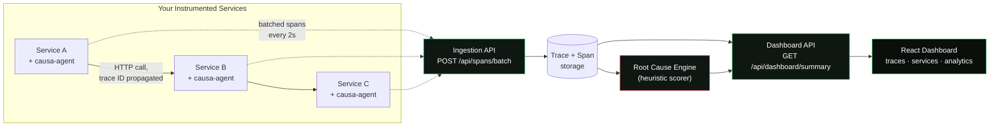

<div align="center">

# CAUSA

### Architecture-Aware, Multi-Layer Failure Diagnosis for Microservices

*Stop reading logs across five tabs to find one root cause. CAUSA finds it for you.*

[](https://openjdk.org/)
[](https://spring.io/projects/spring-boot)
[](https://react.dev/)
[](https://www.typescriptlang.org/)
[](#license)

[Overview](#overview) • [How It Works](#how-it-works) • [Architecture](#architecture) • [Getting Started](#getting-started) • [API Reference](#api-reference) • [Connecting Your Own Service](#connecting-your-own-service) • [Roadmap](#roadmap)

</div>

---

## Overview

Modern backends are rarely one program — they're a chain of services calling services, each with
its own logs, its own metrics, and no shared story of what actually happened to a single failed
request. When something breaks, an engineer ends up manually stitching together timestamps across
five different log streams to figure out *where* it actually went wrong versus *where the failure
just showed up*.

**CAUSA** removes that manual step. It's a distributed tracing and root-cause diagnosis system,
purpose-built for microservice architectures:

- A **lightweight Java agent** drops into any Spring Boot service and automatically instruments
  every HTTP request, propagating a trace ID across service boundaries.
- A **central backend** ingests those spans, correlates them by request, and stores the full
  call tree.
- A **rule-based root-cause engine** analyzes every failed or degraded trace and tells you —
  in plain English, with a confidence score — which service actually caused the failure and how
  it propagated.
- A **live dashboard** visualizes system health, request flow, and lets you drill into any trace's
  full span waterfall.

No APM subscription, no black-box ML model you can't explain, no code changes beyond a dependency
and two config lines.

---

## How It Works

Every request gets a `traceId` the moment it enters the system. As it hops from service to
service, that ID travels along in an HTTP header, and each service reports its own slice of the
work — start time, end time, status, error message — as a **span**. CAUSA's backend stitches
these spans back into a tree:

```
POST /checkout                                    [api-gateway]      12ms
 └─ POST /auth/verify                              [auth-service]     18ms   OK
 └─ INSERT INTO orders                              [database]         34ms   OK
 └─ POST /payments/charge                           [payment-service] 1840ms  ERROR
     └─ connection reset by upstream provider
```

When a trace fails or is abnormally slow, the **Root Cause Engine** scores every span in the tree
against three explainable signals instead of a black-box model:

| Signal | Weight | What it catches |
|---|---|---|
| **Error presence** | 0.5 | The span itself reported a failure |
| **Origin of failure** | 0.3 | This span failed *and none of its children did* — meaning it's the deepest point of failure, not just a span that got dragged down by something below it |
| **Latency contribution** | 0.2 | What % of the total request time this span alone consumed — catches slow-but-not-erroring culprits too |

The result is a verdict you can actually audit: *"Root cause: payment-service (chargeCard). No
failing descendants — this is the deepest point of failure. Failure propagated up through:
api-gateway → payment-service. Error detail: connection reset by upstream provider."* — not just
a black-box score.

---

## Architecture



### Repository layout

This is a monorepo with four independently deployable pieces:

```
causa/
├── backend/              Spring Boot service — ingestion, storage, RCA engine, dashboard API
│   └── src/main/java/com/causa/backend/
│       ├── model/         Span, Trace (JPA entities)
│       ├── dto/            Diagnosis, DashboardSummary, SpanIngestDto
│       ├── repository/    Spring Data JPA repositories
│       ├── service/        SimulationEngine, RootCauseEngine, DashboardService, IngestionService
│       └── controller/    REST endpoints
│
├── agent/                 causa-agent — the Java library that instruments YOUR service
│   └── src/main/java/com/causa/agent/
│       ├── CausaFilter.java                 auto-instruments incoming HTTP requests
│       ├── CausaRestTemplateInterceptor.java propagates trace headers on outgoing calls
│       ├── CausaTracer.java                  manual span API (DB calls, business logic)
│       ├── CausaSpanCollector.java           async batching + delivery to the backend
│       └── CausaAutoConfiguration.java       zero-boilerplate Spring Boot wiring
│
├── demo/                   Two throwaway services proving the pipeline end-to-end
│   ├── demo-auth-service/
│   └── demo-order-service/
│
└── frontend/               React + TypeScript dashboard
    └── src/
        ├── pages/           Dashboard, Traces, TraceDetail, Services, Analytics, Settings
        ├── components/     Sidebar, StatCard, FailureTimelineChart, ServiceHealthTable, ...
        └── api/client.ts    Backend API client
```

---

## Tech Stack

| Layer | Stack |
|---|---|
| Backend | Java 17, Spring Boot 3.5, Spring Data JPA, H2 (dev) / PostgreSQL (prod) |
| Agent | Plain Java + Spring Boot auto-configuration, `java.net.http.HttpClient`, Jackson |
| Frontend | React 18, TypeScript, Vite, React Router, Recharts, Framer Motion |
| Diagnosis | Rule-based heuristic scorer (no external ML dependency — fully explainable) |

---

## Getting Started

You'll run four pieces, in this order. Each is a normal Maven/npm project — no Docker required
for local development.

### 1. Start the backend
```bash
cd backend
./mvnw spring-boot:run
```
Runs on `:8080`, uses an in-memory H2 database, and seeds ~40 simulated traces on boot so the
dashboard isn't empty on first launch. H2 console at `http://localhost:8080/h2-console`
(JDBC URL: `jdbc:h2:mem:causa`).

### 2. Install the agent locally
```bash
cd agent
mvn install
```
Puts `com.causa:causa-agent:0.1.0` into your local Maven repository so any Spring Boot project
— including the demo services below, or your own — can depend on it.

### 3. Run the demo services (optional, but proves the pipeline is real)
```bash
cd demo/demo-auth-service && ./mvnw spring-boot:run    # :8090
cd demo/demo-order-service && ./mvnw spring-boot:run   # :8091
```
Then generate some traffic:
```bash
for i in {1..20}; do curl -s -X POST http://localhost:8091/demo/checkout; echo; sleep 0.3; done
```
`order-service` calls `auth-service` over real HTTP — the trace ID propagates automatically —
then wraps a simulated DB write in a manually-instrumented span. Both are deliberately flaky so
the Root Cause Engine has something genuine to catch.

### 4. Start the dashboard
```bash
cd frontend
npm install
npm run dev
```
Open `http://localhost:5173`. Real traces from the demo services should appear within a couple
of seconds, alongside the seeded simulated ones.

---

## API Reference

### Ingestion (used by the agent — you generally won't call these directly)
| Method | Endpoint | Purpose |
|---|---|---|
| `POST` | `/api/spans` | Ingest a single span |
| `POST` | `/api/spans/batch` | Ingest a batch of spans |

### Simulation (for demos without a real connected service)
| Method | Endpoint | Purpose |
|---|---|---|
| `POST` | `/api/simulate/random` | Generate one randomly-weighted scenario |
| `POST` | `/api/simulate/{scenario}` | Generate a specific scenario — `success`, `db_timeout`, `auth_failure`, `payment_error`, `high_latency`, `cascading_failure` |
| `POST` | `/api/simulate/burst/{count}` | Generate `count` random traces at once |

### Reading data
| Method | Endpoint | Purpose |
|---|---|---|
| `GET` | `/api/traces` | Last 50 traces |
| `GET` | `/api/traces/{requestId}` | Full span list for one trace |
| `GET` | `/api/traces/{requestId}/diagnosis` | Run/re-run root cause analysis on a trace |
| `GET` | `/api/dashboard/summary` | Aggregate stats powering the dashboard |

---

## Connecting Your Own Service

Add the dependency:
```xml
<dependency>
    <groupId>com.causa</groupId>
    <artifactId>causa-agent</artifactId>
    <version>0.1.0</version>
</dependency>
```

Configure it:
```properties
causa.enabled=true
causa.endpoint=http://localhost:8080
causa.service-name=your-service-name
```

That's it for automatic HTTP-request tracing. Two optional steps for deeper visibility:

**Propagate traces on outgoing calls** (if your service calls others via `RestTemplate`):
```java
@Bean
public RestTemplate restTemplate(CausaRestTemplateInterceptor interceptor) {
    RestTemplate rt = new RestTemplate();
    rt.getInterceptors().add(interceptor);
    return rt;
}
```

**Instrument non-HTTP work** like database calls, since they don't have an HTTP boundary to
auto-instrument:
```java
Order order = causaTracer.trace("database", "INSERT INTO orders", () -> {
    return orderRepository.save(order);
});
```

No changes are needed on the CAUSA backend or frontend — service names, layers, and the request
flow diagram are all derived from whatever spans arrive, nothing is hardcoded.


---

## Roadmap

- [x] Multi-layer span/trace data model
- [x] Simulated multi-service failure scenarios for demoing without a live dependency
- [x] Heuristic root-cause engine with transparent, per-span scoring
- [x] Real ingestion API (`/api/spans`, `/api/spans/batch`)
- [x] `causa-agent` — drop-in Spring Boot instrumentation library
- [x] Dashboard: live stats, failure timeline, service health, request flow
- [x] Trace list + full span waterfall + diagnosis detail view
- [x] Services and analytics views
- [ ] Deployed, publicly accessible demo (Render/Railway + Vercel)
- [ ] PostgreSQL migration for persistent (non-in-memory) storage
- [ ] WebSocket/SSE live updates instead of polling
- [ ] Baseline-deviation signal in the RCA engine (compare a span's latency to its own historical
      p95, not just its share of the current trace)
- [ ] API key / project-scoped ingestion for multi-tenant use
- [ ] Retry queue in the agent so spans aren't dropped if the backend is briefly unreachable

## Known Limitations

Being upfront about what this is and isn't:

- **No authentication on ingestion** — anyone who can reach the backend can post spans. Fine for
  local/academic use, not production-ready as-is.
- **No delivery guarantees** — the agent is fire-and-forget; if CAUSA is down when a batch
  flushes, those spans are lost rather than queued.
- **Trace "closing" is heuristic, not definitive** — since spans from different services can
  arrive at different times, the backend recomputes a trace's status on every new batch rather
  than having a hard signal for "this trace is now complete."
- **Root cause analysis is rule-based, not learned** — a deliberate MVP choice over a causal-graph
  / ML approach, prioritizing explainability and a realistic build timeline over deeper prediction
  power. See [How It Works](#how-it-works) for why that tradeoff was made.

---

## Author

Built by **Pranjal Gupta** ([@Pranjall-Gupta](https://github.com/Pranjall-Gupta)) — final-year
CSE, Microsoft Industry Embedded Program — as a semester project exploring architecture-aware
observability and interpretable failure diagnosis for microservices.

## License

MIT — see [LICENSE](LICENSE).
